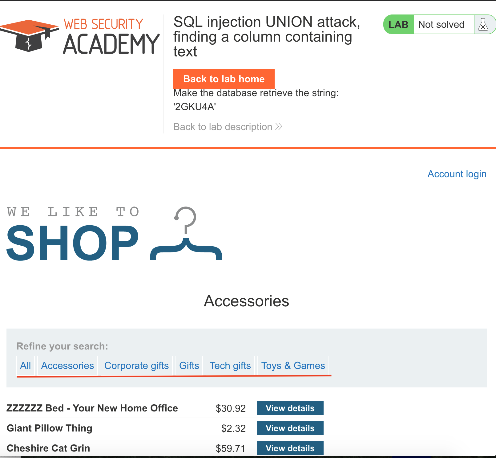
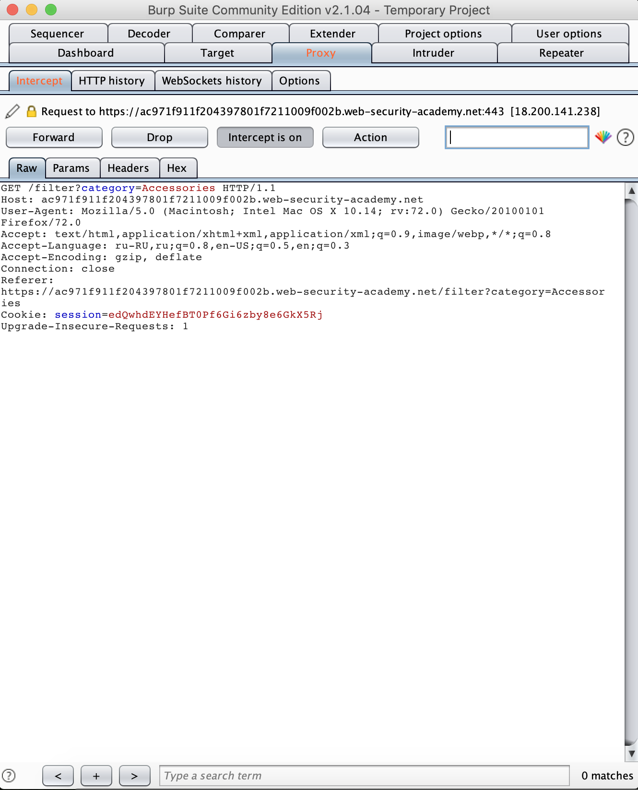
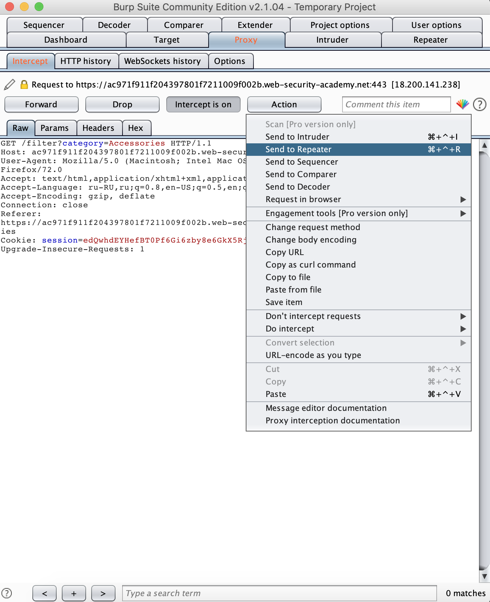
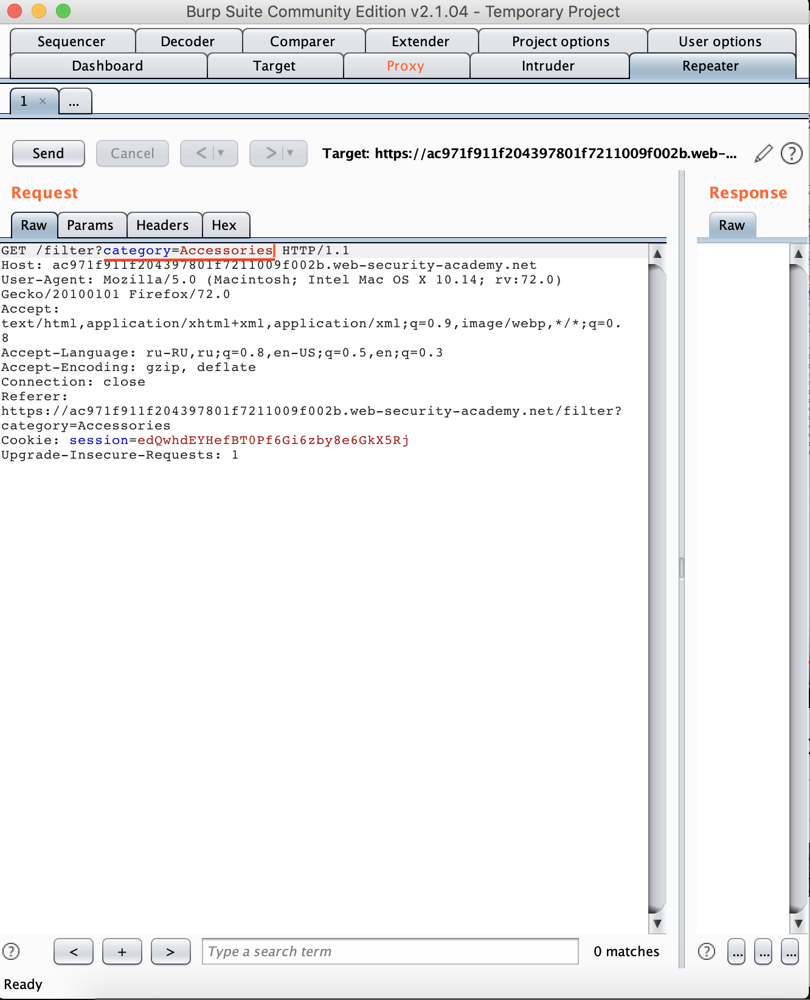
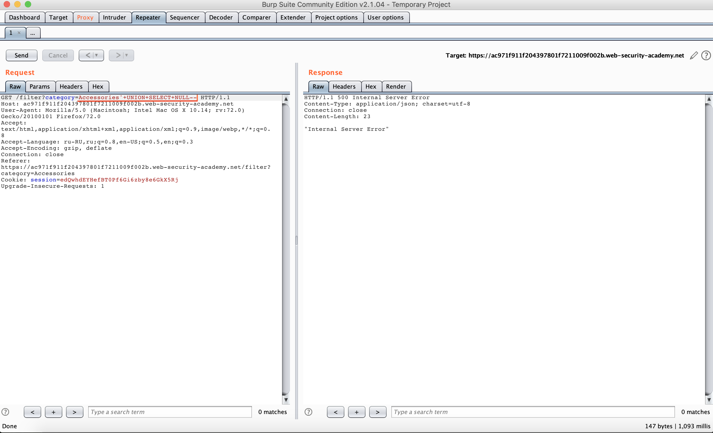
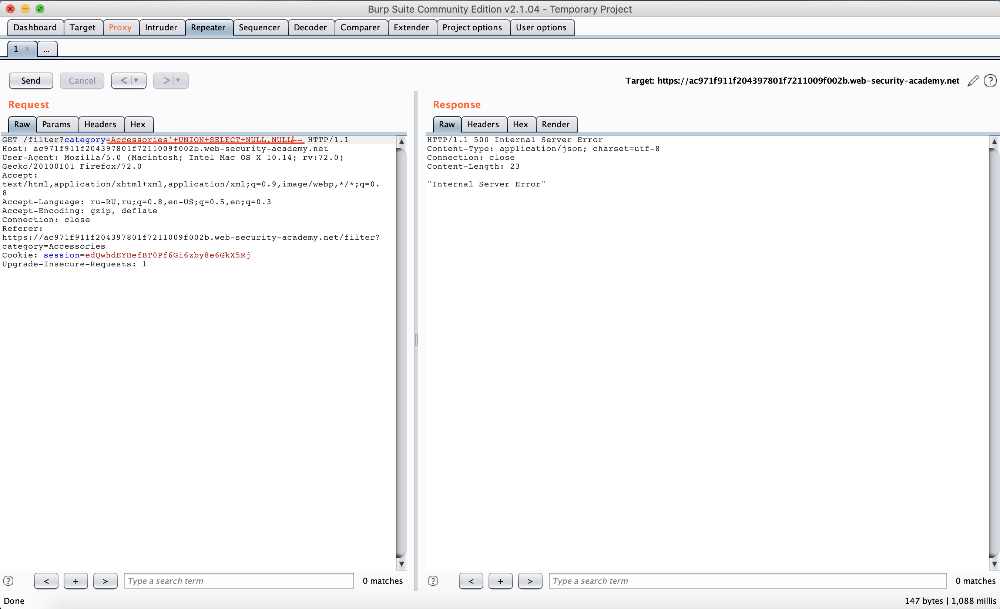
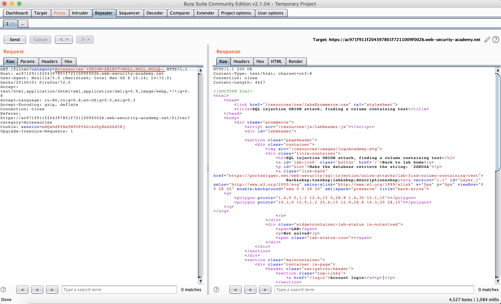
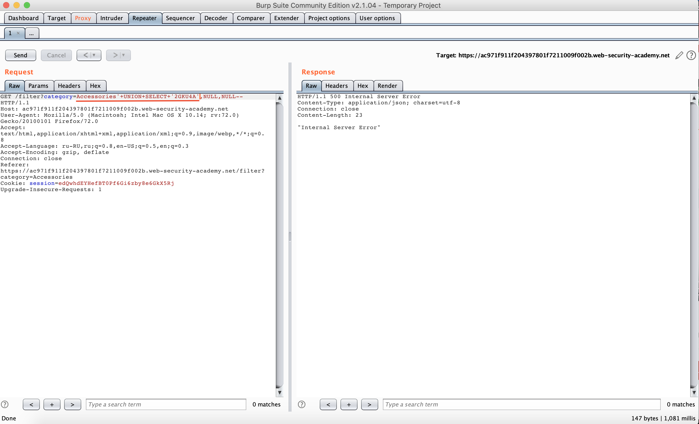

```
Lab: SQL injection UNION attack, finding a column containing text
Задача: Make the database retrieve the string: '2GKU4A'
```
- Выбираем любую категорию

- Начинаем перехват

- Отправляем в repeater

- Находим строчку с category

- Добавляем строчку "'UNION+SELECT+NULL--", чтобы выяснить количество столбцов

- Добавляем NULL пока не исчезнет ошибка


- Заменяем NULL по очереди на требуюмую строчку пока не достигнем результата

- Задание выполнено!

