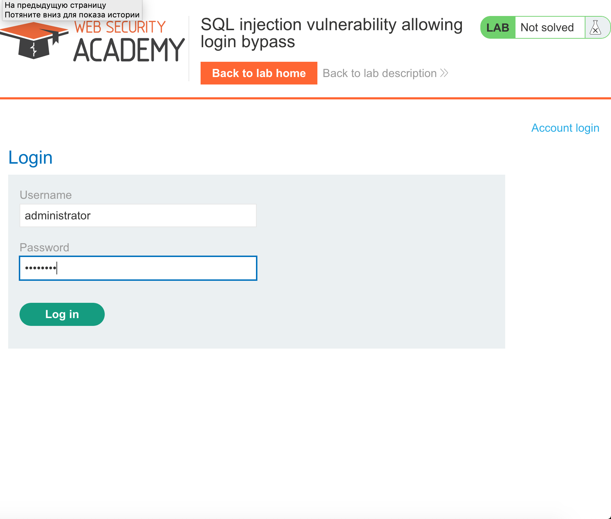
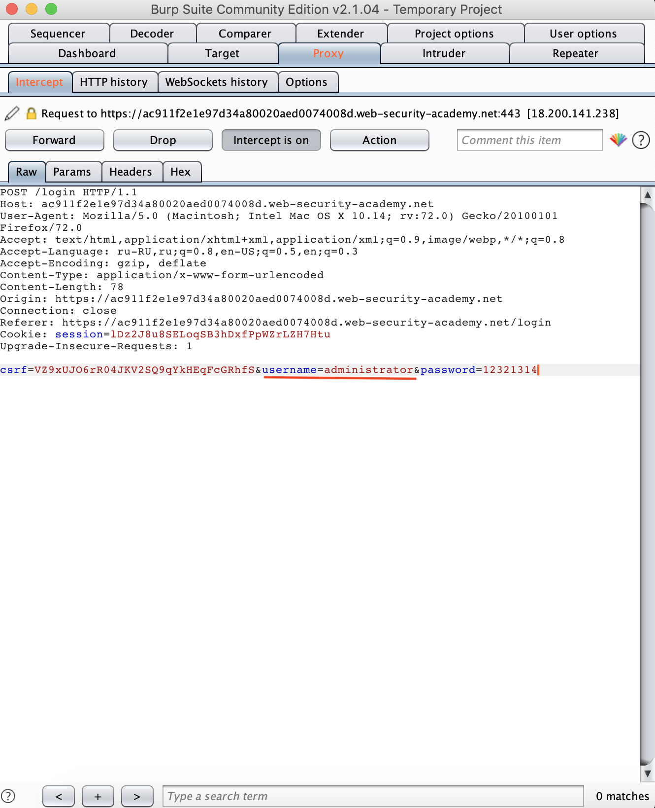
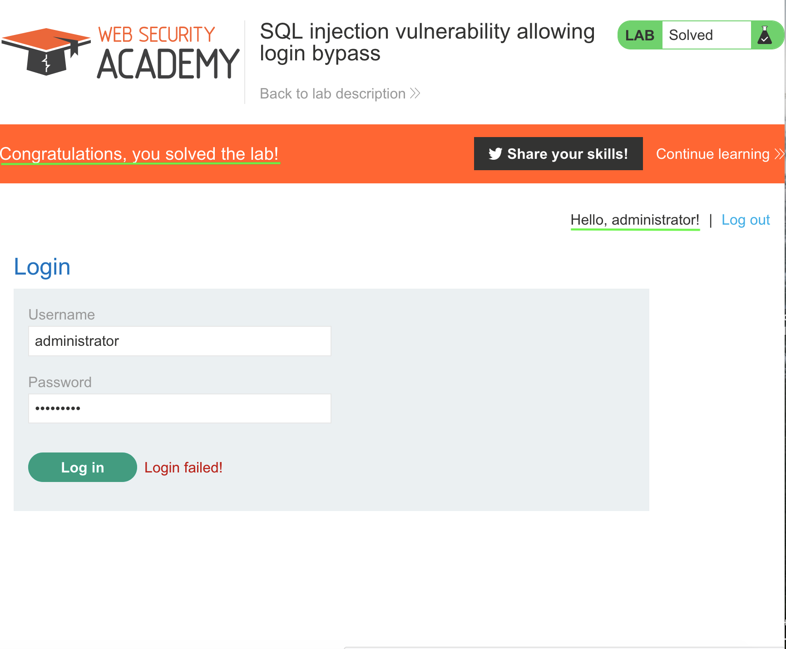

'''
Lab: SQL injection vulnerability allowing login bypass
Задача: This lab contains an SQL injection vulnerability in the login function.
To solve the lab, perform an SQL injection attack that logs in to the application
as the administrator user.
Решение:
1. Нажимаем account login

2.Начинаем перехват, вводим логин администратора и случайный пароль

 3. В поле username сразу после administrator добавляем "'--", это нужно, чтобы убрать проверку пароля.
 
 4. Задание выполнено!
 
'''
