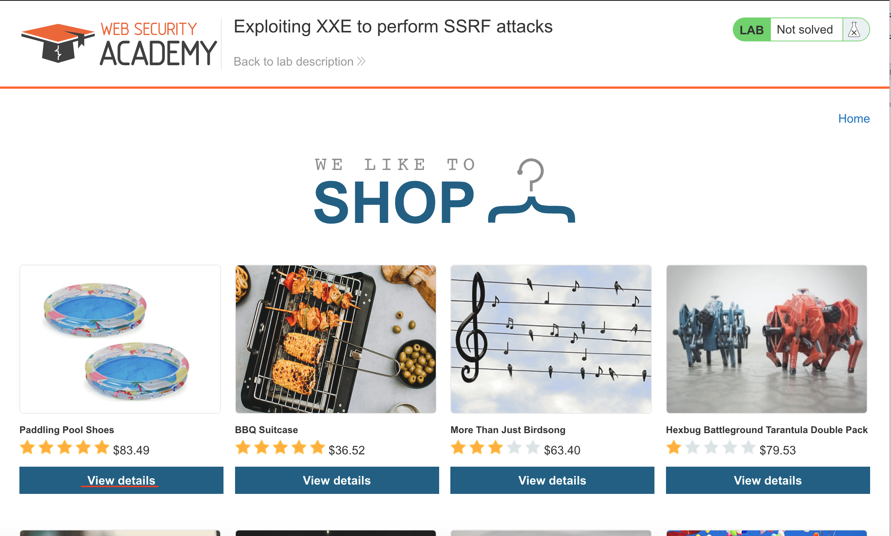
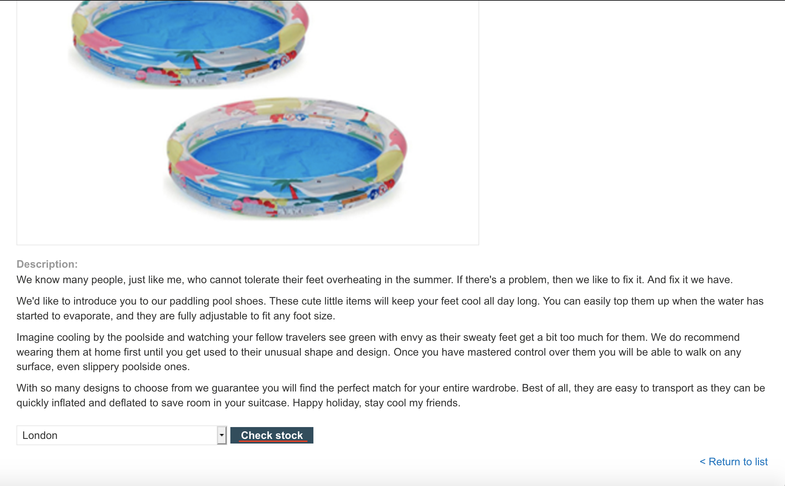
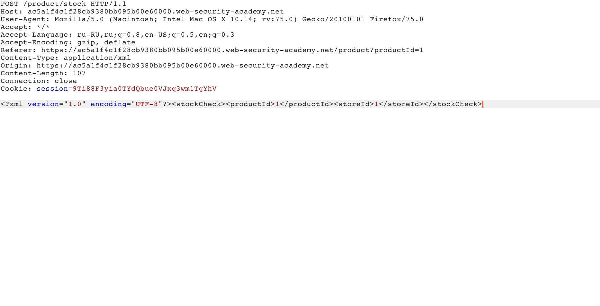
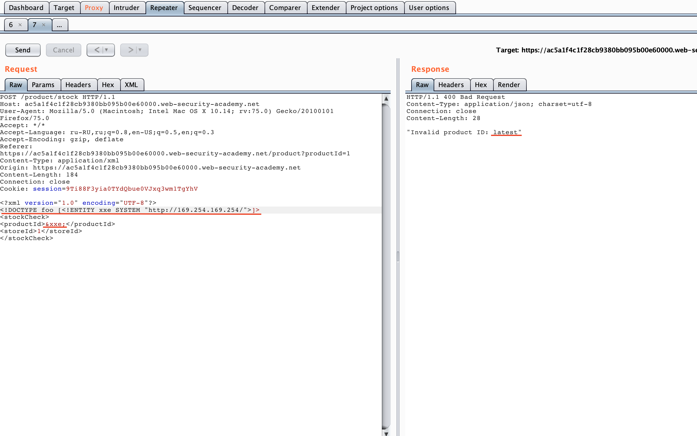
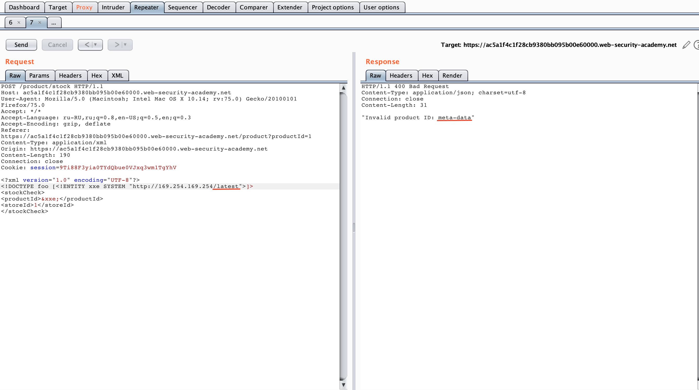
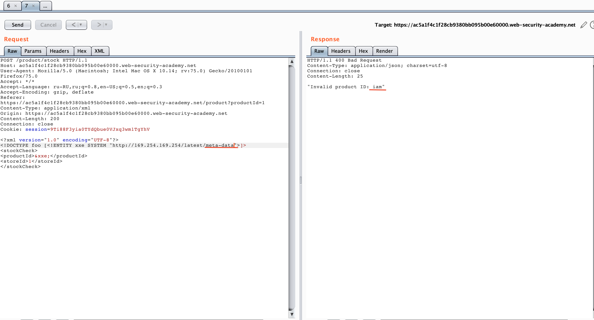
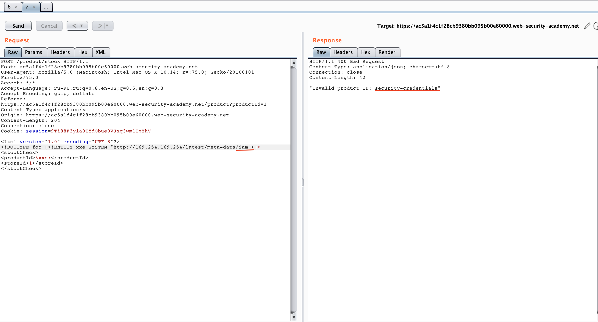
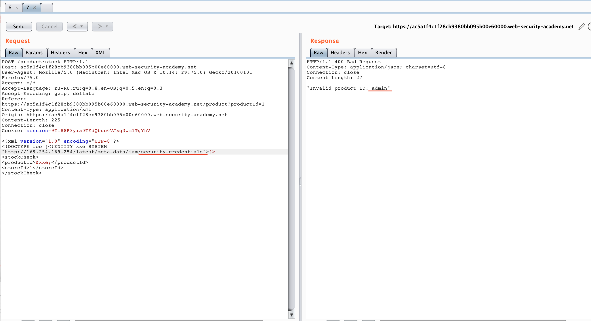
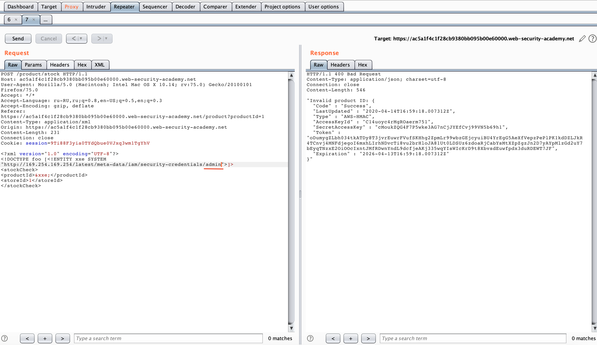
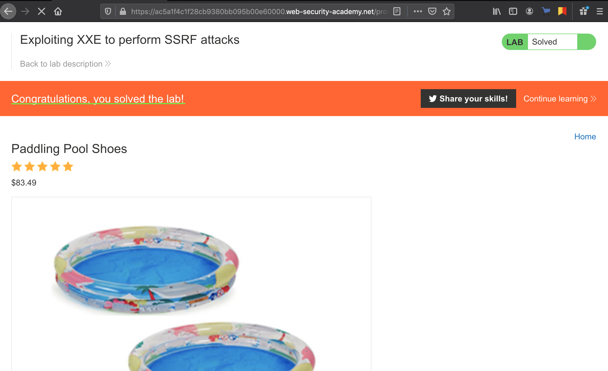

```
Lab: Exploiting XXE to perform SSRF attacks
Задача:  This lab has a "Check stock" feature that parses XML input and returns any unexpected values in the response.
The lab server is running a (simulated) EC2 metadata endpoint at the default URL, which is http://169.254.169.254/. This endpoint can be used to retrieve data about the instance, some of which might be sensitive.
To solve the lab, exploit the XXE vulnerability to perform an SSRF attack that obtains the server's IAM secret access key from the EC2 metadata endpoint. 
Решение:
```
- Вибираем любой продукт

- Нажимаем кнопку "check stock" 

- Перехватываем нужный нам запрос и отправляем в repeater

- Добавляем строку ```"<!DOCTYPE test [ <!ENTITY xxe SYSTEM "http://169.254.169.254/"> ]> "``` и меняем значение productid на "&xxe;"

- Добавляем в нашу строку "/latest"

- Добавляем в нашу строку "/meta-data"

- Добавляем в нашу строку "/iam"

- Добавляем в нашу строку "/security-credentials"

- Добавляем в нашу строку "/admin" и получаем содержимое нужного нам файла

- Получаем подтверждение успешного завершения

